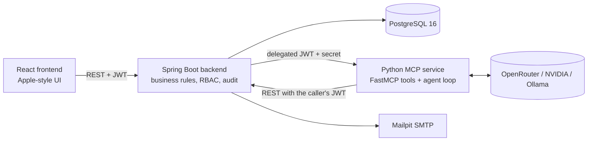

# PeoplePay360: HR & Payroll

An integrated HR and Payroll platform built for the Odoo hackathon brief. The employee record is the hub; contracts and working schedules give payroll its context; attendance and time off capture daily activity; salary structures and sequenced salary rules compute payslips; payruns validate, pay and deliver PDF payslips by email; a live dashboard aggregates everything. Two extensions go beyond the brief: an AI assistant (webchat) whose access is a grantable permission, and a five-stage recruitment pipeline with AI-assisted candidate comparison.

## Architecture



| Component | Stack | Responsibility |
|---|---|---|
| `backend/` | Java 21, Spring Boot 3.3, Spring Security, Flyway, PostgreSQL 16 | Single system of record and single security authority. All business rules, payroll computation, PDF and mail, audit, chat gateway. |
| `frontend/` | React 18, TypeScript, Vite, Tailwind, Radix, TanStack Query | Role-aware interface. Every enumerated value is a dropdown or picker. Reads permissions from the backend; never decides them. |
| `mcp/` | Python 3.12, FastAPI, FastMCP, OpenAI-compatible client | Real MCP server at `/mcp` with thirteen read-only tools, plus the `/chat` agent loop. Stateless, no database access, no stored credentials. |

Security model in one paragraph: five roles from the brief (Employee, HR Manager, HR Payroll User, HR Payroll Manager, Admin) plus per-user permission grants. The assistant is exposed to anyone holding `chat.access`. The Python service forwards the caller's own short-lived delegated token to the backend, which confines chat traffic to read-only GET endpoints on a fixed allow-list and audits every allowed and denied call.

## Repository layout

```
.
├── backend/     Spring Boot service (created by the Backend build prompt)
├── frontend/    React application (created by the Frontend build prompt)
├── mcp/         Python MCP service (created by the MCP build prompt)
├── docs/        Local working documents: feature proposal and the three build prompts (git-ignored)
├── docker-compose.yml        full stack for development and demo
├── docker-compose.test.yml   full stack plus test runners for CI
└── README.md
```

The `docs/` folder is intentionally excluded from version control. Keep your local copy; it holds:

- `docs/2026-09-05_PeoplePay360_Feature_Proposal_v1.md` — the reviewed feature proposal, RBAC model, demo script and roadmap.
- `docs/prompts/2026-09-05_PeoplePay360_Backend_Prompt_v2.md`
- `docs/prompts/2026-09-05_PeoplePay360_Frontend_Prompt_v2.md`
- `docs/prompts/2026-09-05_PeoplePay360_MCP_Prompt_v2.md`

## How the system is built

Each component is built by a coding agent from its own prompt. Every prompt has two parts: Part A (component-specific instructions in five development stages with hard test gates) and Part B (the integration contract, identical in all three prompts: ports, environment variables, JWT claims, permission codes, every REST endpoint, DTO shapes, MCP tool names, the chat gateway contract, AI provider presets, Docker Compose and the shared development protocol).

Five development stages per component:

| Stage | Backend | Frontend | MCP service |
|---|---|---|---|
| 1 | Foundation and security core | Design system, shell, auth, mocks | Settings, security, registry, backend client |
| 2 | Employees, bank accounts, schedules, contracts | People screens | The thirteen tools with model and UI views |
| 3 | Attendance and time off | Time screens | MCP server mounting, guard, Inspector verification |
| 4 | Payroll engine, payslips, delivery, dashboard | Payroll and dashboard screens | Providers and the agent loop |
| 5 | Chat gateway, AI profiles, recruitment, seed, hardening, end-to-end | Assistant, recruitment, admin, real-stack end-to-end | Provider verification, hardening, end-to-end, docs |

A stage is complete only when its gate tests pass in a clean environment and `docs/stages/STAGE_<n>_REPORT.md` exists in the component folder with the real test output.

## Running

Prerequisites: Docker Desktop. For the local AI provider, install Ollama and run `ollama pull llama3.1:8b`.

```bash
docker compose up --build
```

Then open `http://localhost:3000`. Backend API at `http://localhost:8080` (Swagger UI at `/swagger-ui.html`), Mailpit inbox at `http://localhost:8025`. Demo accounts and their passwords are listed in Part B, section B6, of any build prompt. The Admin account can switch the AI provider under Admin → AI Settings (OpenRouter, NVIDIA or Ollama; model chosen from a dropdown fetched from the provider).

## Testing

```bash
docker compose -f docker-compose.test.yml up --build --abort-on-container-exit
```

This runs the backend suite (unit, integration with Testcontainers, RBAC smoke matrix, contract fixtures, end-to-end demo walkthrough), the frontend Playwright suite against the real stack, and the MCP service suite with the deterministic mock provider. Per-component commands are `make verify` in `backend/` and `mcp/` and `npm run verify` in `frontend/`.

## Conventions

- Formal, contraction-free English in documentation; placeholder names only; no personal data anywhere in the repository.
- Files created for planning follow `YYYY-MM-DD_Subject_Version.ext`.
- Deviations from the shared contract are recorded in `docs/CONTRACT_DEVIATIONS.md` inside the component that deviates.
- No commits are made by automated assistants in this repository; the team commits manually after review.
