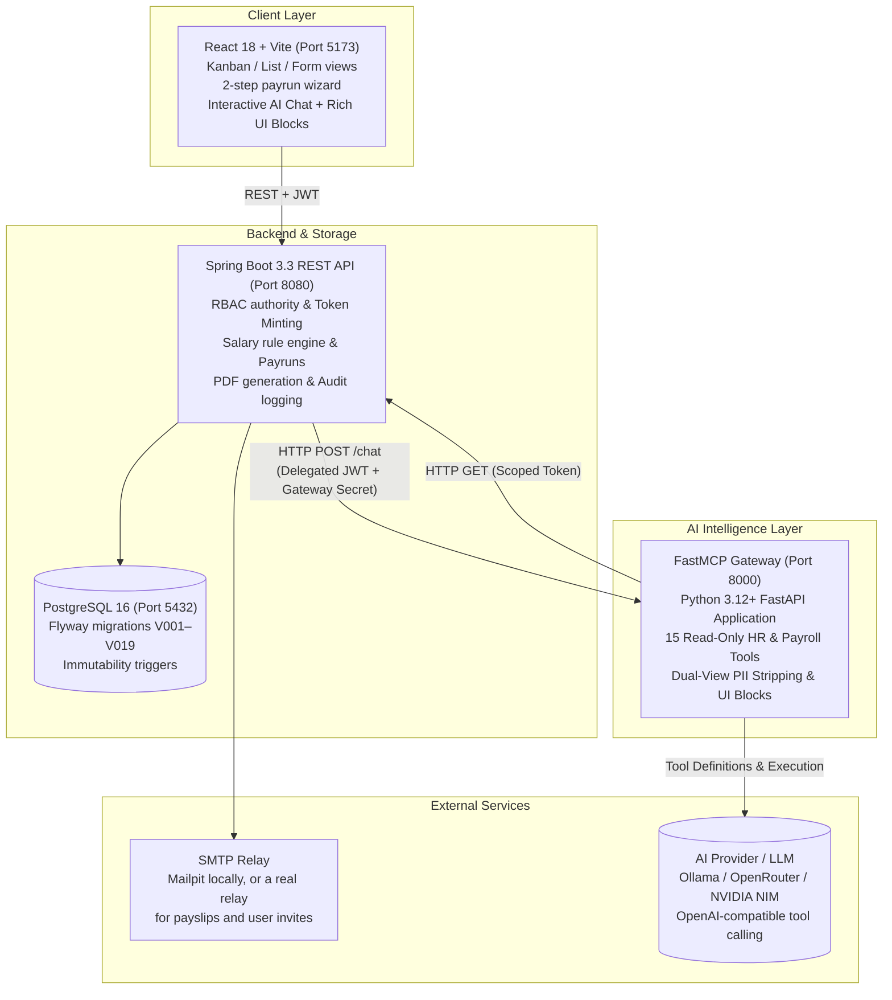

# PeoplePay360: Integrated HR & Payroll Operations Platform

An integrated Human Resource and Payroll platform. **PeoplePay360** connects employee master
profiles, employment contracts, working schedules, daily attendance, time-off requests, sequenced
salary rules, batch payruns, payslip generation, and a live analytics dashboard into one cohesive operational
flow, rather than a set of disconnected CRUD screens.

It also features a secure **AI Assistant** powered by a dedicated **FastMCP service** scoped strictly to HR and payroll queries, with fine-grained role-based access control, dual-view PII protection, interactive UI blocks, in-place prompt editing, and candidate comparison.

> [!NOTE]
> **Runs natively.** No Docker or containers required. PostgreSQL, the Spring Boot JAR, the Python FastMCP service, and the Vite dev server all run directly on the machine.

---

## Architecture



### Tech Stack

| Component | Stack | Responsibilities |
|---|---|---|
| **Backend** (`backend/`) | Java 21, Spring Boot 3.3, Spring Data JPA, Spring Security, Flyway, PostgreSQL 16, OpenPDF | System of record and security authority. Period-specific contract matching, formula-based salary computation, payslip PDF generation, SMTP delivery, audit logging, short-lived delegated token issuance. |
| **MCP Service** (`mcp/`) | Python 3.12+, FastAPI, FastMCP, Pydantic v2, HTTPX, Pytest | Secure AI gateway. Exposes 15 read-only tools, enforces caller's own RBAC permissions, strips PII before LLM context, generates interactive UI blocks, enforces number grounding. |
| **Frontend** (`frontend/`) | React 18, TypeScript, Vite, Tailwind CSS, Radix UI, TanStack Query, Recharts, Lucide Icons | Role-aware client. Kanban, list and form views, smart-count buttons, payrun wizard, live dashboard, conversational AI assistant with in-place editing and typewriter animation. |
| **Database** | PostgreSQL 16 | Flyway-migrated schema (V001–V019), including immutability triggers on paid payslips and an append-only audit log. |

---

## Modules

### 1. Employee Master
Kanban, list and detail views. The employee record is the operational hub linking department, manager, job position, working schedule, active contract, and bank details. Smart-count buttons open pre-filtered Contracts, Attendance, Time Off, and Allocations.

### 2. Departments
Create, rename, and delete departments. Deletion is refused while active employees remain assigned.

### 3. Contracts & Working Schedules
Full contract history is retained while only one contract may be active for a given period; overlaps are strictly rejected. Schedules define the weekly day/start/end/break pattern, and weekly hours are derived automatically from that pattern rather than typed in.

### 4. Attendance
Check-in and check-out, worked hours, manual corrections by authorized users, and an exceptions radar for late arrivals, absences, overtime, and missing check-outs.

### 5. Time Off
Requests with an approve/refuse workflow, allocations showing allocated, taken, and remaining, leave types defining unit and whether allocation is required, and public holidays. Approved leave consumes the matching allocation.

### 6. Salary Structures & Rules
Structures group sequenced rules. Rules compute as a fixed amount, a percentage of an earlier rule, or a dynamic arithmetic formula, across Basic, Allowance, Gross, Deduction, and Net categories. Sequence determines calculation order. Full-width views and interactive rule inspection.

### 7. Payruns
Creating a payrun is a two-step wizard: define scope (structure and period), then explicitly select eligible employees. Processing actions: Compute, Validate, Mark Paid, and Send Payslips. Blockers such as a missing bank account or unapproved leaves surface before finalization.

### 8. Payslips
Per-employee salary computation showing each rule line with category, code, and amount. Individual PDF export and bulk email delivery from the parent payrun with per-payslip delivery status. Paid payslips are immutable, enforced by a database trigger.

### 9. Dashboard
Live KPIs for net salary paid, payslips generated, average salary, approved time off, and attendance health. Salary cost by department, monthly net trend, payroll alerts, and attendance/time-off overviews. Payroll figures are redacted to `null` for roles without payroll permission.

### 10. AI Assistant & FastMCP Service
A dedicated conversational assistant under **AI**, available to every signed-in role.
- **Strict Scope**: Scoped to HR, payroll, company policies, and system usage; off-topic questions are politely declined.
- **Seamless Prompt Editing**: In-place edit allows refining a prompt directly in its existing chat bubble, re-running the turn with updated context without cluttering conversation history.
- **Typewriter Effect**: Frame-timed streaming reveal for smooth reading experience.
- **Provider Support**: Seamlessly connects to local **Ollama** (`qwen3:1.7b`, `llama3.2:3b`), **OpenRouter**, or **NVIDIA NIM**.

### 11. Users, Access & Invites
A login is created **from an employee record**: the picker lists only active, onboarded employees without an account. No password is set by the administrator. The user receives a single-use emailed link (valid 48 hours) to choose their own password. Only the SHA-256 hash of the token is stored.

### 12. Recruitment
Pipeline stages: New → Screening → Interview → Offer → Hired, with applicant comparison against rubric score and salary fit, plus one-click conversion to an employee record.

---

## 🤖 AI Assistant: FastMCP Architecture & Tools

The AI Assistant integrates with the **FastMCP Intelligence Service** (`mcp/`) running on port `8000`.

### Security Guarantees & Flow

```
[User Webchat (React)]
         │
         ▼ (HTTP POST /api/chat/sessions/{id}/messages)
[Spring Boot Backend (Port 8080)]
   │ • Mints Delegated JWT (aud=mcp, act=chat, 5-minute TTL)
   │ • Attaches caller's exact user authorities & rate limits
   ▼ (HTTP POST /chat with X-Gateway-Secret + Bearer Delegated Token)
[Python FastMCP Service (Port 8000)]
   │ 1. Validates X-Gateway-Secret (constant-time HMAC)
   │ 2. Validates Bearer Token & evaluates tool-level permissions
   │ 3. Filters tool catalogue: LLM only sees permitted tools
   │ 4. Invokes LLM (Ollama / OpenRouter / NVIDIA NIM)
   │ 5. Executes requested tools:
   │      │
   │      ▼ (HTTP GET only with Caller's Scoped JWT)
   │   [Spring Boot REST Endpoints] ──► [PostgreSQL 16]
   │      │
   │ 6. Dual-View PII Sanitization: strips email, phone, bank info from model tokens
   │ 7. Rich UI Block Assembly (KPI cards, Data Tables, Direct Links, Refusal Badges)
   │ 8. Enforces Number Grounding against hallucinations
   ▼
[JSON Response: Assistant Markdown + UI Blocks + Trace Evidence]
```

1. **Deny-by-Default RBAC**: Tools check caller permissions extracted from the delegated token. If unauthorized, a clean refusal block is returned without hitting the backend.
2. **Read-Only by Construction**: The MCP client only implements HTTP `GET`. It cannot mutate or delete data.
3. **Dual-View PII Protection**: Sensitive PII (`workEmail`, `phone`, `bankAccountNumber`, `panNumber`) is stripped from the `model_view` passed to the LLM, but retained safely in `ui_view` for UI rendering.
4. **Number Grounding**: Quantities, percentages, and currencies mentioned in the LLM text must exist in the raw tool response; hallucinations are intercepted.

---

### The 15 FastMCP Tools

| # | Tool Name | Required Permission | Backend Endpoint Called | Description & Generated UI Blocks |
|---|---|---|---|---|
| 1 | `whoami` | `authenticated` | `GET /api/auth/me` | Current caller identity, role, and permissions. Generates **KPI** & **List** blocks. |
| 2 | `employee_search` | `employee.read.all` | `GET /api/employees` | Search employees by name, department, status. Strips PII. Generates **Table** block. |
| 3 | `employee_summary` | `employee.read.own` | `GET /api/employees/{id}/summary` | 360° dossier: job info, active contract, attendance, and leave balance. Generates **KPI** & **Link** blocks. |
| 4 | `timeoff_get_balance` | `timeoff_allocation.read.own` | `GET /api/timeoff/balances` | Accrued, taken, pending, and remaining days by leave type. Generates **KPI** & **Table** blocks. |
| 5 | `timeoff_list_pending` | `timeoff_request.read.all` | `GET /api/timeoff/requests` | Pending leave requests awaiting managerial review. Generates **Table** block. |
| 6 | `attendance_list_exceptions` | `attendance.read.all` | `GET /api/attendance/exceptions` | Missing check-outs, late arrivals, absences, and overtime. Generates **KPI** & **Table** blocks. |
| 7 | `payrun_list` | `payrun.read` | `GET /api/payruns` | Payrun batches with state (Draft, Computed, Validated, Paid). Generates **Table** & **Action** blocks. |
| 8 | `payrun_list_issues` | `payrun.read` | `GET /api/payruns/{id}/issues` | Pre-flight check for blockers (unlinked bank, overlaps, missing rules). Generates **KPI** & **Table** blocks. |
| 9 | `payslip_list` | `payslip.read.own` | `GET /api/payslips` | List payslips with gross pay, deductions, and net amounts. Generates **Table** block. |
| 10 | `payslip_explain` | `payslip.read.own` | `GET /api/payslips/{id}` | Rule-by-rule formula breakdown, base values, and PDF link. Generates **KPI** & **Table** blocks. |
| 11 | `dashboard_kpis` | `dashboard.read.hr` | `GET /api/reports/dashboard` | Executive analytics: net salary disbursed, headcount, attendance rate. Generates multiple **KPI** blocks. |
| 12 | `contract_list_expiring` | `contract.read.all` | `GET /api/contracts` | Contracts expiring within a customizable window (e.g. 30/60/90 days). Generates **Table** block. |
| 13 | `contract_get_current` | `contract.read.own` | `GET /api/contracts/active` | Current contract terms, wage structure, and renewal date. Generates **KPI** & **Link** blocks. |
| 14 | `candidate_compare` | `candidate.compare` | `GET /api/recruitment/openings/{id}/comparison` | Compare 2–5 applicants against rubric scores and salary expectations. Generates **KPI** & **Table** blocks. |
| 15 | `system_tools_list` | `authenticated` | In-memory Registry | Returns the catalog of tools currently available to the caller's role. Generates **List** block. |

---

### Example Queries by Role

#### 1. Employee Self-Service
Employees only access their own records (`.own` permission scope):

* **Query**: *"How many days of paid leave do I have left?"*
  * **Tools Used**: `timeoff_get_balance`
  * **Output**: Exact remaining days across Paid Leave, Sick Leave, and Casual Leave with a structured balance table.
* **Query**: *"Explain the deductions and net pay on my latest payslip."*
  * **Tools Used**: `payslip_list`, `payslip_explain`
  * **Output**: Clear breakdown of Gross earnings, Provident Fund (PF), Professional Tax (PT), and Net take-home with formula explanation.
* **Query**: *"Do I have any missing check-ins or attendance exceptions this month?"*
  * **Tools Used**: `attendance_list_exceptions`
  * **Output**: Summary of any missed check-outs or late arrivals with direct links to submit regularization.
* **Query**: *"What are the key terms and renewal date on my current contract?"*
  * **Tools Used**: `contract_get_current`
  * **Output**: Wage amount, scheduled weekly hours, contract start date, and end date.

#### 2. HR Manager
Managers view team-wide attendance, contracts, and profiles:

* **Query**: *"Give me a 360-degree employee summary for Jordan Lee."*
  * **Tools Used**: `employee_search`, `employee_summary`
  * **Output**: Full dossier showing department, active contract, leave utilization, attendance percentage, and direct profile link.
* **Query**: *"Which employee contracts are expiring soon?"*
  * **Tools Used**: `contract_list_expiring`
  * **Output**: Table of contracts expiring in the next 60 days, department, wage, and manager details.
* **Query**: *"Who has missing check-outs this week?"*
  * **Tools Used**: `attendance_list_exceptions`
  * **Output**: List of flagged employees with date, missing punch type, and manager contact.
* **Query**: *"What is the status of pending time-off requests?"*
  * **Tools Used**: `timeoff_list_pending`
  * **Output**: Table of pending requests awaiting review with duration and leave category.

#### 3. HR Payroll Manager & Admin
Full access to payroll batches, structures, and organizational KPIs:

* **Query**: *"Is anything blocking the latest payrun from being validated?"*
  * **Tools Used**: `payrun_list`, `payrun_list_issues`
  * **Output**: Pre-flight validation report flagging employees with missing bank accounts or unassigned salary structures before approval.
* **Query**: *"Explain the calculation formula behind Jordan Lee's payslip."*
  * **Tools Used**: `employee_search`, `payslip_list`, `payslip_explain`
  * **Output**: Rule-by-rule mathematical trace (e.g. `BASIC = Fixed 50,000`, `HRA = 40% of BASIC = 20,000`, `PF = 12% of BASIC = 6,000`).
* **Query**: *"Show recent payruns, their validation status, and total disbursement amounts."*
  * **Tools Used**: `payrun_list`
  * **Output**: Batches table showing period, employee count, status (Draft / Validated / Paid), and total cost.
* **Query**: *"Give me an executive KPI overview of current payroll spend and active headcount."*
  * **Tools Used**: `dashboard_kpis`
  * **Output**: High-level KPI cards for monthly net payroll, active employee count, and average salary.
* **Query**: *"What live MCP tools are active and what records can they query?"*
  * **Tools Used**: `system_tools_list`
  * **Output**: Complete permission-filtered list of operational tools available to the signed-in session.

---

## Role-Based Access Control

| Feature | Employee | HR Manager | HR Payroll User | HR Payroll Manager | Admin |
|---|:---:|:---:|:---:|:---:|:---:|
| Own profile, attendance, leave | ✅ | ✅ | ✅ | ✅ | ✅ |
| Submit attendance and leave | ✅ | ✅ | ✅ | ✅ | ✅ |
| Manage employees, contracts, schedules | ❌ | ✅ | ✅ | ✅ | ✅ |
| Approve or refuse leave | ❌ | ✅ | ✅ | ✅ | ✅ |
| View payruns and payslips | ❌ | ❌ | ✅ | ✅ | ✅ |
| Create and compute payruns | ❌ | ❌ | ✅ | ✅ | ✅ |
| Configure salary structures and rules | ❌ | ❌ | Read-only | ✅ | ✅ |
| Validate and mark payruns paid | ❌ | ❌ | ❌ | ✅ | ✅ |
| Users, permissions, AI settings | ❌ | ❌ | ❌ | ❌ | ✅ |
| AI assistant (RBAC-delegated lookups) | ✅ | ✅ | ✅ | ✅ | ✅ |

*HR roles without payroll permissions see dashboard payroll metrics redacted to `null`, not merely hidden on the client.*

---

## Repository Layout

```text
PeoplePay360-HR-Payroll/
├── backend/                        # Spring Boot 3.3 REST API (Java 21)
│   ├── src/main/java/com/peoplepay360/
│   │   ├── common/                 # Errors, audit, encryption converter
│   │   ├── config/                 # Security, JWT, CORS, app properties
│   │   ├── controller/             # REST controllers (auth, chat, payruns, etc.)
│   │   ├── dto/                    # Request and response records
│   │   ├── model/                  # JPA entities
│   │   ├── repository/             # Spring Data repositories
│   │   ├── security/               # Guards, scope resolution, rate limiting
│   │   └── service/                # Payroll engine, PDF, mail, invites, AI gateway
│   ├── src/main/resources/
│   │   ├── application.properties.example  # Configuration template
│   │   └── db/migration/           # Flyway migrations V001–V019
│   └── pom.xml
│
├── mcp/                            # FastMCP Intelligence Service (Python 3.12+)
│   ├── app/
│   │   ├── backend.py              # Read-only AsyncClient for Spring Boot API
│   │   ├── blocks.py               # Rich UI blocks (kpi, table, link, action)
│   │   ├── chat.py                 # Tool execution loop & conversational turns
│   │   ├── main.py                 # FastAPI application entrypoint (port 8000)
│   │   ├── mcp_server.py           # FastMCP server instance
│   │   ├── providers.py            # Connectors for Ollama, OpenRouter, NVIDIA NIM
│   │   ├── registry.py             # Tool registry with permission gates
│   │   ├── schemas.py              # Pydantic models for chat and tool payloads
│   │   ├── security.py             # HMAC secret & delegated JWT decoding
│   │   ├── settings.py             # Pydantic v2 application settings
│   │   ├── views.py                # Dual-view PII sanitization
│   │   └── tools/                  # 15 FastMCP read-only tool implementations
│   ├── requirements.txt            # Python dependencies
│   ├── pyproject.toml
│   └── tests/                      # Pytest suite (tools, security, views, chat)
│
├── frontend/                       # React 18 + TypeScript + Vite
│   ├── src/
│   │   ├── api/                    # Typed API client, hooks, and shared types
│   │   ├── app/                    # Router, shell layout, route guards
│   │   ├── auth/                   # AuthProvider and permission checks
│   │   ├── components/ui/          # Design-system primitives & UI blocks
│   │   ├── features/               # Domain feature modules (chat, payroll, etc.)
│   │   └── test/                   # Vitest setup and integration test fixtures
│   ├── index.html
│   ├── package.json
│   └── vite.config.ts              # Dev server on 5173, proxies /api to 8080
│
├── start-all.sh                    # Unified startup script for all 3 services
└── README.md
```

---

## Local Setup

### Prerequisites
* **JDK 21+**
* **Node.js 18+** with npm
* **Python 3.12+** with pip and venv
* **PostgreSQL 16** running on `5432`
* **SMTP Endpoint**: [Mailpit](https://github.com/axllent/mailpit/releases) on port `1025` is sufficient for local testing; user invites require a real SMTP relay.

---

### 1. Database Setup

```sql
CREATE DATABASE peoplepay;
CREATE USER peoplepay WITH PASSWORD 'peoplepay';
GRANT ALL PRIVILEGES ON DATABASE peoplepay TO peoplepay;
```

Flyway automatically executes migrations V001–V019 on startup, seeding schema and demo data.

> [!WARNING]
> **Database user ownership**: Migrations use `CREATE OR REPLACE FUNCTION` and `ALTER TABLE`. If the database was created under a different superuser, transfer ownership:
> ```sql
> REASSIGN OWNED BY <old_owner> TO peoplepay;
> ```

---

### 2. Backend (Spring Boot 3.3)

```bash
cd backend
mvn -DskipTests package
java -jar target/peoplepay360-backend.jar
```

* API: `http://localhost:8080`
* Swagger / OpenAPI: `http://localhost:8080/swagger-ui/index.html`
* Health Check: `http://localhost:8080/actuator/health`

---

### 3. FastMCP Intelligence Service (Python FastAPI)

```bash
cd mcp
python -m venv .venv

# On Windows:
.venv\Scripts\activate

# On Linux/macOS:
source .venv/bin/activate

pip install -r requirements.txt
uvicorn app.main:app --host 127.0.0.1 --port 8000 --reload
```

* FastMCP API: `http://127.0.0.1:8000`
* Service Health: `http://127.0.0.1:8000/health`
* Interactive API Docs: `http://127.0.0.1:8000/docs`

---

### 4. Frontend (React 18 + Vite)

```bash
cd frontend
npm install
npm run dev
```

Open `http://localhost:5173`. Vite automatically proxies `/api` requests to port `8080`.

---

### 🚀 One-Command Startup (`start-all.sh`)

On Unix/macOS environments, launch all services concurrently:
```bash
./start-all.sh
```

---

## Configuration

### Backend Environment Variables

| Variable | Default | Purpose |
|---|---|---|
| `DB_USER` / `DB_PASSWORD` | `peoplepay` | Database credentials |
| `SERVER_PORT` | `8080` | Backend port |
| `JWT_KEY_PATH` | `./keys/jwt.pem` | RSA signing key (auto-generated if absent) |
| `APP_ENCRYPTION_KEY` | dev fallback | AES-256-GCM key for encrypting sensitive fields and API keys |
| `COMPANY_NAME` | `OXP Pvt Ltd` | Displayed on schedules, payslips, and emails |
| `APP_BASE_URL` | `http://localhost:5173` | Base URL used to assemble user invite links |
| `INVITE_TTL_HOURS` | `48` | Lifetime of emailed invite tokens |
| `MAIL_HOST` / `MAIL_PORT` | `localhost` / `1025` | SMTP host and port |
| `MAIL_USERNAME` / `MAIL_PASSWORD` | empty | SMTP authentication credentials |
| `MAIL_AUTH` / `MAIL_STARTTLS` | `false` | Enable for STARTTLS (port 587) |
| `MAIL_SSL` | `false` | Enable for implicit SSL/TLS (port 465) |
| `MAIL_FROM` | `payroll@peoplepay360.local` | Sender email address |

### FastMCP Service Environment Variables (`mcp/.env`)

| Variable | Default | Purpose |
|---|---|---|
| `MCP_HOST` / `MCP_PORT` | `127.0.0.1` / `8000` | FastMCP host and listening port |
| `BACKEND_URL` | `http://127.0.0.1:8080` | Spring Boot REST endpoint |
| `GATEWAY_SECRET` | shared secret | Constant-time HMAC header (`X-Gateway-Secret`) matching backend |
| `AI_PROVIDER` | `OLLAMA` | Default provider (`OLLAMA`, `OPENROUTER`, `NVIDIA`, `MOCK`) |
| `OLLAMA_BASE_URL` | `http://127.0.0.1:11434` | Ollama local endpoint |
| `OLLAMA_MODEL` | `qwen3:1.7b` | Recommended lightweight tool-calling model |

---

## Demo Accounts

Seeded with 40 employees, 4 departments, contracts, attendance logs, leave balances, and historical payruns.

| Role | Email | Password |
|---|---|---|
| **Admin** | `admin@peoplepay.local` | `Admin@12345` |
| **HR Payroll Manager** | `payroll.manager@peoplepay.local` | `Manager@12345` |
| **HR Payroll User** | `payroll@peoplepay.local` | `Payroll@12345` |
| **HR Manager** | `hr@peoplepay.local` | `Hr@12345` |
| **Employee** | `employee@peoplepay.local` | `Employee@12345` |

*Login is rate-limited to 10 attempts per IP per 15 minutes (in-memory).*

---

## Testing & Quality Assurance

```bash
# 1. Backend Build & Unit/Integration Tests
cd backend && mvn -DskipTests package

# 2. FastMCP Security & Tool Suite
cd mcp
pytest

# 3. Frontend Typecheck & Build
cd frontend
npm run typecheck
npm run build
```

---

## Choosing an AI Model

The assistant is most effective when paired with models trained for structured **Tool Calling**:
* **Ollama (Local)**:
  * **`qwen3:1.7b`** (Recommended, ~1.4 GB): Fastest local inference (~3s per turn on consumer hardware). Pull via `ollama pull qwen3:1.7b`.
  * **`llama3.2:3b`** (~2.0 GB) and **`qwen2.5:3b`** (~1.9 GB) also offer strong tool-calling reliability.
  * *Avoid reasoning-only models such as `deepseek-r1`, which think at length without calling tools.*
* **OpenRouter / NVIDIA NIM (Cloud)**:
  * Supports high-performance cloud models including `meta-llama/llama-3.3-70b-instruct`, `mistralai/mistral-large`, and `qwen/qwen-2.5-72b-instruct`.
