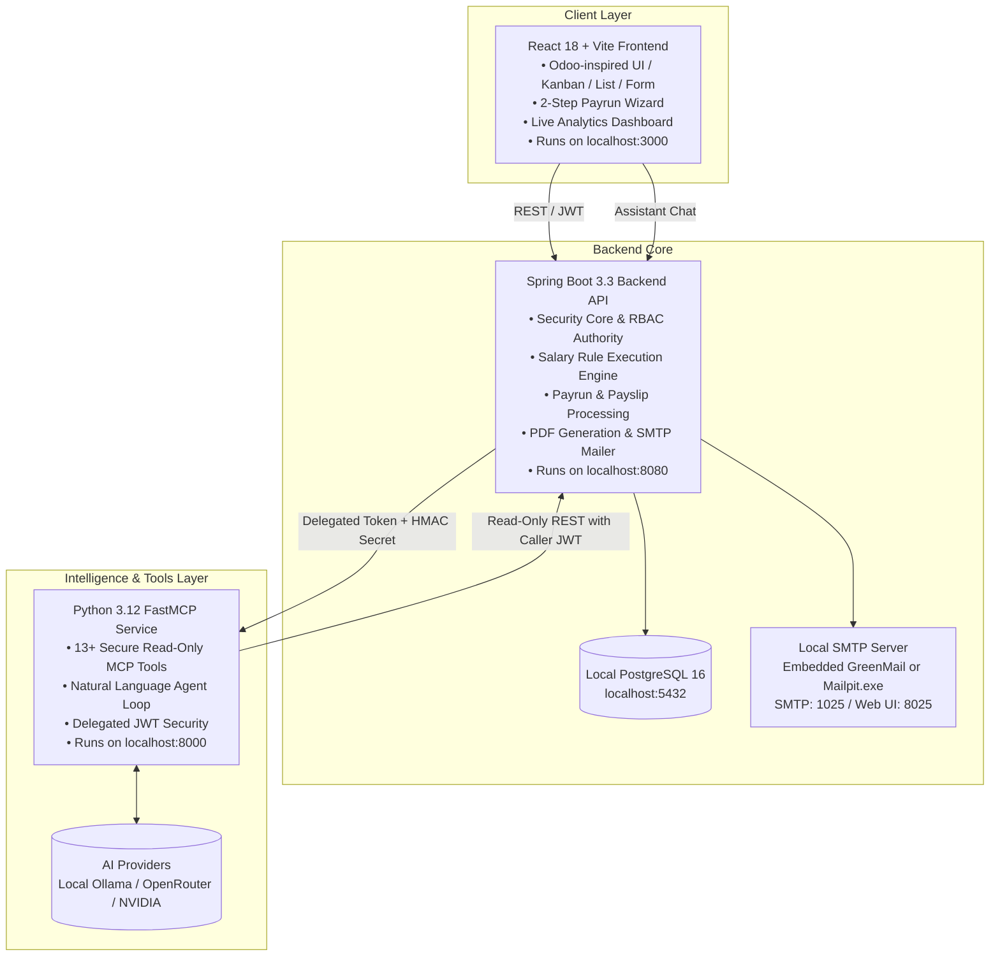

# PeoplePay360: Integrated HR & Payroll Operations Platform

An enterprise-grade, integrated Human Resource and Payroll operations platform built for modern workforce management. **PeoplePay360** eliminates data silos by connecting employee master profiles, employment contracts, working schedules, daily attendance, time-off requests, sequenced salary calculation rules, batch payruns, payslip generation, and real-time executive analytics into a seamless, operational flow.

Beyond standard HR and payroll capabilities, PeoplePay360 includes an **AI-powered HR Assistant** powered by a standalone **Model Context Protocol (MCP)** service, and a **5-stage recruitment pipeline** with AI candidate evaluation.

> [!NOTE]
> **100% Native Local Execution:** Designed to run purely on the local machine without containerization or Docker dependencies.

---

## Architecture Overview



### Component Tech Stack

| Component | Stack | Responsibilities |
|---|---|---|
| **Backend** (`backend/`) | Java 21, Spring Boot 3.3, Spring Data JPA, Spring Security, Flyway, PostgreSQL 16, OpenPDF | Single system of record and security authority. Business validation rules, period-specific contract matching, formula-based salary rule computation, payslip PDF generation, bulk email delivery via local SMTP, audit logging, and chat security gateway. |
| **Frontend** (`frontend/`) | React 18, TypeScript, Vite, Tailwind CSS, Radix UI, TanStack Query, Recharts, Lucide Icons | Responsive, role-aware client. Supports Kanban, List, and Form views with live-updating smart buttons. Implements the 2-step Payrun Creation Wizard and live visual dashboard. |
| **MCP Service** (`mcp/`) | Python 3.12, FastAPI, FastMCP, Uvicorn, OpenAI / LangChain client | Standalone AI service exposing 13+ read-only tools to LLMs via Model Context Protocol. Purely stateless with no direct database access; executes queries strictly through backend REST endpoints with caller's delegated JWT. |
| **Database & Mail** | Local PostgreSQL 16 & Local SMTP | Local relational storage with ACID compliance. Local SMTP capture server (standalone Mailpit binary or embedded GreenMail) for zero-external-dependency payslip delivery verification. |

---

## Core Features & Modules Breakdown

### 1. Employee Master Hub (360° Management)
* **Multiple Display Modes:** Switch between Kanban cards, filterable Tabular Lists, and detailed Form views.
* **Operational Hub:** Employee profiles act as the central point linking identity, department, reporting manager, job position, work schedule, active contract, and bank accounts.
* **Smart Count Buttons:** Real-time summary badges directly on the employee profile that link to pre-filtered views for **Contracts**, **Attendance**, **Time Off**, and **Leave Allocations**.

### 2. Contract & Schedule Management
* **Active vs. Historical Tracking:** Maintain a complete historical archive of contracts while strictly enforcing that only one contract is active and applicable per payroll period.
* **Employment Terms:** Captures duration, wages, department, position, assigned working schedule, and salary structure.
* **Working Schedules & Shift Patterns:** Define schedules with working days, shift start/end times, and break durations. Total weekly hours are calculated dynamically, establishing standard expectations for attendance and overtime calculations.

### 3. Operational Attendance & Time Tracking
* **Daily Time Logging:** Check-in, check-out, and automatic calculation of total worked hours.
* **Exception & Anomaly Detection:** Real-time flagging of attendance exceptions including **Late arrivals**, **Early departures**, **Absences**, **Overtime**, and **Missing check-outs**.
* **Audit & Corrections:** Controlled manual correction workflow restricted to authorized HR managers, tracking edits for payroll accuracy.

### 4. Time Off & Leave Balance Management
* **Configurable Leave Policies:** Define custom time-off types (Annual, Sick, Casual, Unpaid) with configurable unit measures (days or hours), allocation rules, and payroll deductibility.
* **Allocation Workflow:** Two-step balance allocation requiring HR manager approval before leave becomes available to the employee.
* **Balance Tracking:** Live calculation of accrued, allocated, taken, and remaining leave balances.
* **Automated Consumption:** Approved leave requests automatically deduct from available allocations and seamlessly feed into payroll payrun calculations.

### 5. Sequenced Salary Structure & Rules Engine
* **Hierarchical Salary Structures:** Modular structures (e.g., *Standard Full-Time*, *Executive*, *Contractor*) that bundle rules together.
* **Rule Categories:** Distinct salary categories including **Basic**, **Allowances**, **Gross**, **Deductions**, and **Net Pay**.
* **Ordered Rule Execution:** Strict sequence-based computation where dependent formulas (such as tax brackets or percentage allowances) build upon earlier calculated totals.
* **Dynamic Computation Models:** Supports fixed amounts, percentage-based calculations, and dynamic mathematical formulas referencing employee contract wage and attendance days.

### 6. Payrun Batch Processing & Creation Wizard
* **2-Step Creation Wizard:**
  * **Step 1 (Scope):** Select payroll period (start/end date) and target Salary Structure.
  * **Step 2 (Selection):** Filter and select eligible employees with active contracts before initializing the batch.
* **Payroll Lifecycle Actions:** Execute batch operations: **Compute Payslips** $\rightarrow$ **Validate Batch** $\rightarrow$ **Mark as Paid** $\rightarrow$ **Send Payslips**.
* **Pre-Finalization Validation Alerts:** Automatic warning indicators highlight anomalies before payroll closure (e.g., missing employee bank accounts, contract overlaps, unapproved leave requests, or duplicate payslips).
* **Archival & History:** Completed payruns are locked and archived for auditing and reporting.

### 7. Payslip Generation & Bulk Delivery (Local SMTP)
* **Detailed Payslip Breakdowns:** Itemized records showing contract wage, worked days, leave days, basic pay, individual allowance lines, deduction lines, gross pay, and final net pay.
* **PDF Export:** One-click generation of professional, printable PDF payslips.
* **Local SMTP Distribution:** Dispatches payslip PDFs via standard SMTP to a local mailer (e.g. standalone Mailpit binary or embedded GreenMail), allowing real-time viewing and download without external internet or real email sending.

### 8. Real-Time Executive Payroll Dashboard
* **Live KPI Summary Cards:** Instant visibility into **Total Net Salary Paid**, **Payslips Generated**, **Average Salary**, **Approved Time-Off Days**, and **Attendance Health Index**.
* **Interactive Visual Analytics:**
  * Salary cost breakdown by Department.
  * Monthly net salary expenditure trends.
  * Attendance distribution (Present vs. Late vs. Absent vs. Overtime).
* **Multi-Dimensional Filters:** Filter dashboard insights by date period, department, and employment type (Full-time, Part-time, Contractor).

### 9. AI Assistant & Model Context Protocol (MCP) *(Bonus Feature)*
* **Natural Language Queries:** Query payroll, employee status, leave balances, and attendance health in plain English.
* **13+ FastMCP Tools:** Exposes tools such as `get_employee_summary`, `get_active_contract`, `query_leave_balance`, `check_payroll_warnings`, and `get_department_payroll_stats`.
* **Zero Trust & Delegated Security:** The MCP agent runs statelessly and calls the Spring Boot API using the caller's delegated JWT. Queries are strictly restricted to read-only endpoints permitted by the user's role.
* **Multi-Provider Support:** Connect to **Ollama** (local offline LLM on `localhost:11434`), **OpenRouter**, or **NVIDIA NIM**.

### 10. Recruitment Pipeline *(Bonus Feature)*
* **5-Stage Pipeline:** Visual board for managing applicants through *Applied $\rightarrow$ Screened $\rightarrow$ Interview $\rightarrow$ Offer $\rightarrow$ Hired*.
* **AI Candidate Evaluation:** Automated resume parsing and qualification comparison against job requirements.

---

## Role-Based Access Control (RBAC) Matrix

PeoplePay360 enforces a 5-tier role hierarchy with fine-grained access policies:

| Feature / Module | Employee | HR Manager | HR Payroll User | HR Payroll Manager | System Admin |
|---|:---:|:---:|:---:|:---:|:---:|
| **View Own Profile, Attendance & Leaves** | ✅ | ✅ | ✅ | ✅ | ✅ |
| **Submit Attendance & Leave Requests** | ✅ | ✅ | ✅ | ✅ | ✅ |
| **Manage Employees, Contracts & Schedules** | ❌ | ✅ | ✅ | ✅ | ✅ |
| **Approve / Reject Leave Requests** | ❌ | ✅ | ✅ | ✅ | ✅ |
| **View Payruns & Payslips** | ❌ | ❌ | ✅ | ✅ | ✅ |
| **Create & Process Payruns** | ❌ | ❌ | ✅ | ✅ | ✅ |
| **Configure Salary Structures & Rules** | ❌ | ❌ | Read-Only | ✅ | ✅ |
| **Finalize & Mark Payruns Paid** | ❌ | ❌ | ❌ | ✅ | ✅ |
| **System Admin, Users & Permissions** | ❌ | ❌ | ❌ | ❌ | ✅ |
| **AI Assistant Access** | Via Permission (`chat.access`) | Via Permission | Via Permission | Via Permission | ✅ |

---

## Repository Layout

```text
PeoplePay360-HR-Payroll/
├── backend/                  # Spring Boot 3.3 REST API (Java 21)
│   ├── src/main/java/        # Controllers, Services, Repositories, JPA Entities
│   │   ├── config/           # Security, JWT, CORS, Mail configurations
│   │   ├── controller/       # REST controllers (Auth, Employee, Contract, Time, Payroll, Chat)
│   │   ├── dto/              # Request/Response data transfer objects
│   │   ├── model/            # JPA entities (Employee, Contract, Attendance, Payrun, Payslip, etc.)
│   │   ├── repository/       # Spring Data JPA repositories
│   │   └── service/          # Business engines (Payroll calculation, PDF, SMTP Email, Audit)
│   ├── src/main/resources/   # application.yml & Flyway migration scripts
│   └── pom.xml               # Maven dependencies and build configuration
│
├── frontend/                 # React 18 Application (TypeScript & Vite)
│   ├── src/
│   │   ├── assets/           # Static styles, images, and branding
│   │   ├── components/       # UI components (Kanban, DataTables, Modals, SmartButtons)
│   │   ├── context/          # Auth context, permission checks, and toast notifications
│   │   ├── pages/            # View pages (Employees, Contracts, Attendance, TimeOff, Payruns, Dashboard)
│   │   ├── services/         # Axios API client services connecting to backend
│   │   └── types/            # TypeScript interfaces and enumeration models
│   ├── package.json          # Node dependencies
│   └── vite.config.ts        # Vite build & proxy settings
│
├── mcp/                      # Python 3.12 Model Context Protocol Service
│   ├── app/
│   │   ├── tools/            # 13+ FastMCP tool definitions
│   │   ├── agent/            # Conversational agent loop and prompt templates
│   │   ├── security/         # Token validation and backend client wrapper
│   │   └── main.py           # FastAPI + FastMCP server entry point
│   └── pyproject.toml        # Poetry / Pip package configuration
│
├── Documents/                # Hackathon requirements & specification PDF
└── README.md                 # Project documentation
```

---

## Native Local Setup & Execution Guide

Run all services natively on your local machine.

### Prerequisites
* **Java:** JDK 21+ installed and configured on `PATH`
* **Node.js:** v18+ or v20+ with `npm`
* **Python:** v3.11 or v3.12
* **Database:** PostgreSQL 16 installed locally as a Windows/system service
* **Local SMTP:** Mailpit standalone executable (or embedded GreenMail in Spring Boot)

---

### Step 1: Database Setup (PostgreSQL)
1. Ensure your local PostgreSQL service is running on port `5432`.
2. Create the application database using `psql` or pgAdmin:
   ```sql
   CREATE DATABASE peoplepay360;
   ```
3. The backend automatically runs Flyway migrations on startup to create all tables, constraints, salary rules, and demo seed data.

---

### Step 2: Local SMTP Server (For Payslip Delivery)
To capture and inspect dispatched payslip emails without sending real outbound emails:

* **Option A: Standalone Mailpit binary (Recommended)**
  * Download the standalone `mailpit` binary for Windows from [Mailpit Releases](https://github.com/axllent/mailpit/releases) (single `.exe`, zero install).
  * Run the executable in a terminal:
    ```bash
    mailpit.exe
    ```
  * **SMTP port:** `1025` (Spring Boot connects here)
  * **Web Inbox UI:** Open `http://localhost:8025` in your browser to view incoming payslips and PDF attachments.

* **Option B: Embedded GreenMail in Spring Boot**
  * Spring Boot can run an embedded in-memory SMTP server (`greenmail-spring`) on port `1025` or `3025` automatically during execution.

---

### Step 3: Backend Setup (Spring Boot)
1. Navigate to the backend directory:
   ```bash
   cd backend
   ```
2. Verify database and mail settings in `src/main/resources/application.yml`:
   ```yaml
   spring:
     datasource:
       url: jdbc:postgresql://localhost:5432/peoplepay360
       username: postgres
       password: postgres
     mail:
       host: localhost
       port: 1025
       properties:
         mail:
           smtp:
             auth: false
             starttls:
               enable: false
   ```
3. Run the backend:
   ```bash
   # On Windows PowerShell / CMD:
   mvnw.cmd clean spring-boot:run
   ```
4. Verify backend is live:
   * **API Base URL:** `http://localhost:8080`
   * **Swagger API Docs:** `http://localhost:8080/swagger-ui.html`

---

### Step 4: Frontend Setup (React + Vite)
1. Navigate to the frontend directory:
   ```bash
   cd frontend
   ```
2. Install dependencies and start the development server:
   ```bash
   npm install
   npm run dev
   ```
3. Open `http://localhost:3000` in your web browser.

---

### Step 5: MCP Intelligence Service Setup (Python)
1. Navigate to the `mcp` directory:
   ```bash
   cd mcp
   ```
2. Create and activate a Python virtual environment:
   ```bash
   python -m venv .venv
   # On Windows:
   .venv\Scripts\activate
   ```
3. Install dependencies:
   ```bash
   pip install -r requirements.txt
   ```
4. Start the service:
   ```bash
   uvicorn app.main:app --host 127.0.0.1 --port 8000 --reload
   ```
5. FastMCP server runs on `http://localhost:8000`.

---

## Pre-Configured Demo Accounts

The database comes pre-seeded with representative organizational data, departments, salary structures, and demo user accounts for immediate evaluation:

| Role | Email / Username | Default Password | Access Scope |
|---|---|---|---|
| **Admin** | `admin@peoplepay360.internal` | `Admin@123` | Full administrative control, user roles, AI settings |
| **HR Payroll Manager** | `payroll.mgr@peoplepay360.internal` | `Manager@123` | Full HR and Payroll control, salary rules & payslip approval |
| **HR Payroll User** | `payroll.user@peoplepay360.internal` | `User@123` | Payrun generation and payslip computation |
| **HR Manager** | `hr.mgr@peoplepay360.internal` | `Hr@123` | Employee profiles, contracts, attendance & leave approvals |
| **Employee** | `john.doe@peoplepay360.internal` | `Employee@123` | Personal profile, attendance check-in, leave requests |

---

## Live Demonstration Walkthrough Scenarios

For live hackathon evaluations and project presentations, the system is designed to demonstrate two complete end-to-end scenarios:

### Scenario 1: Full Employee Lifecycle to Paid Payslip
1. **Employee Profile:** Open **Employees** $\rightarrow$ switch between Kanban and List views $\rightarrow$ open an employee record $\rightarrow$ demonstrate smart-button navigation.
2. **Contract & Schedule Validation:** Show active contract linked to the employee, confirming wage and assigned working schedule.
3. **Attendance & Work Days:** Review recorded check-in/out logs for the month, demonstrating automatic worked hour calculations and exception flags.
4. **Payrun Wizard Execution:** Navigate to **Payruns** $\rightarrow$ click **New Payrun** $\rightarrow$ choose period and Salary Structure $\rightarrow$ step 2: filter and select employees $\rightarrow$ click **Create Payrun**.
5. **Compute & Verify:** Click **Compute Payslips** $\rightarrow$ inspect calculated payslip lines (Basic wage, sequenced allowance rules, tax/statutory deduction rules, final Net Salary).
6. **Validation Alerts:** Demonstrate system warnings (e.g., alert on missing bank details or unapproved leave).
7. **Approval & Delivery:** Validate the Payrun $\rightarrow$ click **Mark as Paid** $\rightarrow$ click **Send Payslips** $\rightarrow$ open local SMTP web inbox (`localhost:8025`) and show the delivered payslip PDF attachment.

### Scenario 2: Leave Allocation to Request & Payroll Impact
1. **Leave Allocation:** Under **Time Off** $\rightarrow$ **Allocations**, allocate 15 days of Paid Time Off to an employee and approve it as HR Manager.
2. **Leave Request:** Log in as the Employee $\rightarrow$ submit a 3-day Paid Leave request.
3. **Approval Flow:** Log in as HR Manager $\rightarrow$ approve the request $\rightarrow$ verify that the employee's remaining allocation balance is automatically deducted.
4. **Payroll Integration:** Generate a payrun for that period $\rightarrow$ observe how the salary computation engine accounts for approved leave days vs. worked days in the final payslip line items.

### Scenario 3 (Bonus): AI Assistant (MCP) Natural Language Queries
1. Click the AI Assistant widget in the bottom right corner.
2. Ask: *"Who has missing check-outs or attendance exceptions this week?"*
3. Ask: *"Compare the total salary expenditure of Engineering vs. Marketing in August."*
4. Observe the agent calling MCP tools with delegated JWT tokens, returning structured data while respecting role permissions.

---

## Local Testing & Verification

Run tests directly using local CLI tools:

```bash
# 1. Backend unit and integration tests (JUnit 5, Mockito)
cd backend
mvnw.cmd test

# 2. Frontend unit and component tests
cd ../frontend
npm test

# 3. Python FastMCP tool tests
cd ../mcp
pytest
```

---

## Future Roadmap

With additional development cycles, the platform is architected to support:
* **Multi-Currency & Regional Localization:** Configurable country-specific tax rules (e.g., US W-2/1099, UK PAYE, India TDS/PF/ESI).
* **Direct Bank Payment Integration:** Automated disbursement via NACHA / SEPA / Open Banking APIs directly from the Payrun "Mark as Paid" action.
* **Biometric Hardware Integration:** Webhook listeners for real-time sync with physical biometric fingerprint and RFID turnstiles.
* **Self-Service Employee Portal Mobile App:** Native mobile app for GPS-geofenced mobile check-ins and mobile payslip access.
