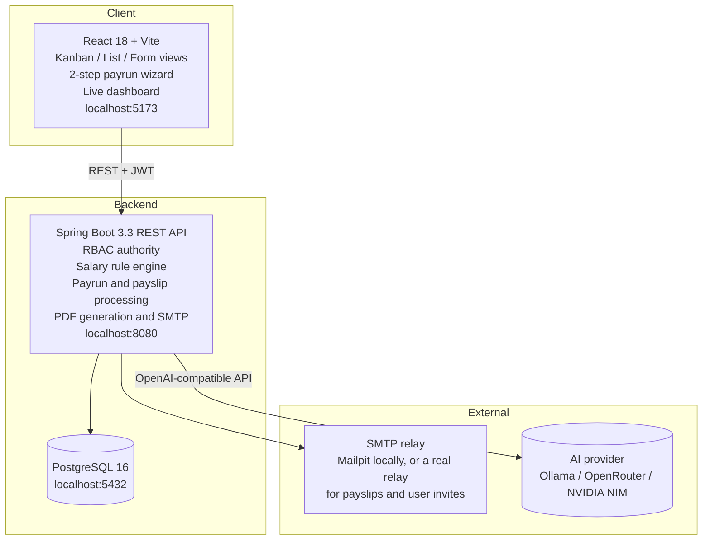

# PeoplePay360: Integrated HR & Payroll Operations Platform

An integrated Human Resource and Payroll platform. **PeoplePay360** connects employee master
profiles, employment contracts, working schedules, daily attendance, time-off requests, sequenced
salary rules, batch payruns, payslip generation and a live analytics dashboard into one operational
flow, rather than a set of disconnected CRUD screens.

It also ships an **AI assistant** scoped to HR and payroll questions, and a **recruitment pipeline**
with candidate comparison.

> [!NOTE]
> **Runs natively.** No Docker or containers. PostgreSQL, the Spring Boot JAR and the Vite dev
> server all run directly on the machine.

---

## Architecture



### Tech stack

| Component | Stack | Responsibilities |
|---|---|---|
| **Backend** (`backend/`) | Java 21, Spring Boot 3.3, Spring Data JPA, Spring Security, Flyway, PostgreSQL 16, OpenPDF | System of record and security authority. Period-specific contract matching, formula-based salary computation, payslip PDF generation, SMTP delivery, audit logging, AI provider gateway. |
| **Frontend** (`frontend/`) | React 18, TypeScript, Vite, Tailwind, Radix UI, TanStack Query, Recharts | Role-aware client. Kanban, list and form views, smart-count buttons, payrun wizard, live dashboard, assistant. |
| **Database** | PostgreSQL 16 | Flyway-migrated schema (V001–V019), including immutability triggers on paid payslips and an append-only audit log. |

---

## Modules

### 1. Employee master
Kanban, list and detail views. The employee record is the hub linking department, manager, job
position, working schedule, active contract and bank details. Smart-count buttons open pre-filtered
Contracts, Attendance, Time Off and Allocations.

### 2. Departments
Create, rename and delete departments. Deletion is refused while employees are still assigned.

### 3. Contracts and working schedules
Full contract history is retained while only one contract may be active for a given period; overlaps
are rejected. Schedules define the weekly day/start/end/break pattern, and weekly hours are derived
from that pattern rather than typed in.

### 4. Attendance
Check-in and check-out, worked hours, manual corrections by authorised users, and an exceptions view
for late arrivals, absences, overtime and missing check-outs.

### 5. Time off
Requests with an approve/refuse workflow, allocations showing allocated, taken and remaining, leave
types defining unit and whether allocation is required, and public holidays. Approved leave consumes
the matching allocation.

### 6. Salary structures and rules
Structures group ordered rules. Rules compute as a fixed amount, a percentage of an earlier rule, or
a formula, across Basic, Allowance, Gross, Deduction and Net categories. Sequence determines
calculation order. A cross-structure **Salary Rules** screen lists every rule with its owning
structure.

### 7. Payruns
Creating a payrun is two steps: define scope (structure and period), then explicitly select eligible
employees. Only then is the batch created. Processing actions are Compute, Validate, Mark Paid and
Send Payslips. Blockers such as a missing bank account surface before finalisation.

### 8. Payslips
Per-employee salary computation showing each rule line with category, code and amount. Individual
PDF export, and bulk email delivery from the parent payrun with per-payslip delivery status. Paid
payslips are immutable, enforced by a database trigger.

### 9. Dashboard
Live KPIs for net salary paid, payslips generated, average salary, approved time off and attendance
health. Salary cost by department, monthly net trend, payroll alerts, and attendance, time off and
department overviews. Filterable by period, department and employee type. Payroll figures are
redacted for roles without payroll permission.

### 10. AI assistant
A dedicated page under **AI**, available to every signed-in role. Answers are scoped to HR, payroll
and product usage; off-topic questions are declined. Markdown output, conversation history and
search.

Configuration is one paste: pick **OpenRouter**, **NVIDIA NIM** or **Ollama**, fetch the model list,
choose a model, connect. Ollama needs no key.

> [!IMPORTANT]
> The assistant answers from the model only. It cannot read live records yet. Tool-backed lookups
> depend on the MCP service, which is **not part of this build** and is marked *coming soon* in the
> UI.

### 11. Users, access and invites
A login is created **from an employee record**: the picker lists only active, onboarded employees
without an account. No password is set by the administrator. The user receives a single-use emailed
link, valid 48 hours, to choose their own password. Only the SHA-256 hash of the token is stored.
Invites can be re-sent, which invalidates the previous link.

Permissions are the role baseline plus explicit grants minus denials, with a full audit trail.

### 12. Recruitment
Pipeline stages New → Screening → Interview → Offer → Hired, with candidate comparison and
conversion to an employee record.

---

## Role-based access

| Feature | Employee | HR Manager | HR Payroll User | HR Payroll Manager | Admin |
|---|:---:|:---:|:---:|:---:|:---:|
| Own profile, attendance, leave | ✅ | ✅ | ✅ | ✅ | ✅ |
| Submit attendance and leave | ✅ | ✅ | ✅ | ✅ | ✅ |
| Manage employees, contracts, schedules | ❌ | ✅ | ✅ | ✅ | ✅ |
| Approve or refuse leave | ❌ | ✅ | ✅ | ✅ | ✅ |
| View payruns and payslips | ❌ | ❌ | ✅ | ✅ | ✅ |
| Create and compute payruns | ❌ | ❌ | ✅ | ✅ | ✅ |
| Configure salary structures and rules | ❌ | ❌ | Read-only | ✅ | ✅ |
| Validate and mark payruns paid | ❌ | ❌ | ❌ | ✅ | ✅ |
| Users, permissions, AI settings | ❌ | ❌ | ❌ | ❌ | ✅ |
| AI assistant | ✅ | ✅ | ✅ | ✅ | ✅ |

HR roles see the dashboard with every payroll figure redacted to `null`, not merely hidden in the UI.

---

## Repository layout

```text
PeoplePay360-HR-Payroll/
├── backend/                        # Spring Boot 3.3 REST API (Java 21)
│   ├── src/main/java/com/peoplepay360/
│   │   ├── common/                 # Errors, audit, encryption converter
│   │   ├── config/                 # Security, JWT, CORS, app properties
│   │   ├── controller/             # REST controllers
│   │   ├── dto/                    # Request and response records
│   │   ├── model/                  # JPA entities
│   │   ├── repository/             # Spring Data repositories
│   │   ├── security/               # Guards, scope resolution, rate limiting
│   │   └── service/                # Payroll engine, PDF, mail, invites, AI gateway
│   ├── src/main/resources/
│   │   ├── application.properties  # Config (properties, not YAML)
│   │   └── db/migration/           # Flyway V001–V019
│   └── pom.xml
│
├── frontend/                       # React 18 + TypeScript + Vite
│   ├── src/
│   │   ├── api/                    # Typed client and shared types
│   │   ├── app/                    # Router, shell, route guards
│   │   ├── auth/                   # Auth provider and permissions
│   │   ├── components/ui/          # Design-system primitives
│   │   ├── features/               # One folder per module
│   │   └── mocks/                  # MSW handlers for offline UI work
│   └── vite.config.ts              # Dev server on 5173, proxies /api to 8080
│
└── README.md
```

---

## Local setup

### Prerequisites
* JDK 21+
* Node.js 18+ with npm
* PostgreSQL 16 running on `5432`
* An SMTP endpoint. [Mailpit](https://github.com/axllent/mailpit/releases) on `1025` is enough for
  payslips; user invites need a relay that can reach real inboxes.

### 1. Database

```sql
CREATE DATABASE peoplepay;
CREATE USER peoplepay WITH PASSWORD 'peoplepay';
GRANT ALL PRIVILEGES ON DATABASE peoplepay TO peoplepay;
```

Flyway runs on startup and creates the schema plus demo data.

> [!WARNING]
> **The application's database user must own the schema objects.** Migrations use
> `CREATE OR REPLACE FUNCTION` and `ALTER TABLE`, which PostgreSQL refuses if the objects belong to
> another role. If the database was first created by a different user, transfer ownership before
> deploying, or startup fails part-way through a migration:
>
> ```sql
> REASSIGN OWNED BY <old_owner> TO peoplepay;
> ```
>
> Objects belonging to an extension should be left alone.

### 2. Backend

```bash
cd backend
mvn -DskipTests package
java -jar target/peoplepay360-backend.jar
```

Run it from the `backend/` directory. The JWT signing key is persisted at `./keys/jwt.pem` relative
to the working directory, so starting elsewhere generates a new key and signs everyone out.

* API: `http://localhost:8080`
* OpenAPI: `http://localhost:8080/swagger-ui/index.html`

### 3. Frontend

```bash
cd frontend
npm install
npm run dev
```

Open `http://localhost:5173`. Vite proxies `/api` to the backend.

---

## Configuration

Everything reads from environment variables with development defaults, so the app starts unconfigured.

| Variable | Default | Purpose |
|---|---|---|
| `DB_USER` / `DB_PASSWORD` | `peoplepay` | Database credentials |
| `SERVER_PORT` | `8080` | Backend port |
| `JWT_KEY_PATH` | `./keys/jwt.pem` | RSA signing key, generated if absent |
| `APP_ENCRYPTION_KEY` | dev fallback | AES-256-GCM key for bank details and API keys |
| `COMPANY_NAME` | `OXP Pvt Ltd` | Shown on schedules and emails |
| `APP_BASE_URL` | `http://localhost:5173` | Used to build invite links |
| `INVITE_TTL_HOURS` | `48` | Invite link lifetime |
| `MAIL_HOST` / `MAIL_PORT` | `localhost` / `1025` | SMTP endpoint |
| `MAIL_USERNAME` / `MAIL_PASSWORD` | empty | SMTP credentials |
| `MAIL_AUTH` / `MAIL_STARTTLS` | `false` | Enable both for a real relay |
| `MAIL_FROM` | `payroll@peoplepay360.local` | Sender address |

> [!CAUTION]
> Never commit credentials. Keep local secrets in `backend/.env.local`, which is git-ignored, and
> load them before starting:
>
> ```bash
> cd backend && set -a && . ./.env.local && set +a && java -jar target/peoplepay360-backend.jar
> ```

Without SMTP configured the app still runs. Invites simply fail and say so in the interface.

---

## Demo accounts

Seeded with 40 employees, 4 departments, contracts, attendance, leave and historical payruns.

| Role | Email | Password |
|---|---|---|
| Admin | `admin@peoplepay.local` | `Admin@12345` |
| HR Payroll Manager | `payroll.manager@peoplepay.local` | `Manager@12345` |
| HR Payroll User | `payroll@peoplepay.local` | `Payroll@12345` |
| HR Manager | `hr@peoplepay.local` | `Hr@12345` |
| Employee | `employee@peoplepay.local` | `Employee@12345` |

Login is rate limited to 10 attempts per IP per 15 minutes. The counter is in memory, so restarting
the backend clears it.

---

## Demonstration scenarios

**Employee to paid payslip.** Create an employee, give them a contract with a schedule and salary
structure, record attendance, then create a payrun for the period. Select the employee, compute,
review the rule-by-rule breakdown and any warnings, validate, mark paid, and email the payslip PDF.

**Leave allocation to payroll impact.** Define a leave type requiring allocation, grant and approve
an allocation, submit a request as the employee, approve it, then watch the balance decrease and the
unpaid days flow into the next payslip computation.

**Onboarding to first login.** Create the employee, then create their user from Users & Access. They
receive an emailed link, set their own password and sign in with only the modules their role permits.

---

## Testing

```bash
# Backend build
cd backend && mvn -DskipTests package

# Frontend type check and production build
cd frontend && npm run typecheck && npm run build
```

There is an end-to-end API suite covering every endpoint across all five roles, including permission
denials, ownership checks and payslip immutability. It restores the database to its seeded baseline
when it finishes, so it can be run repeatedly without degrading the demo data.

Because of the login rate limit, allow a backend restart between consecutive full runs.

---

## Known limitations

* **MCP tool calling is not implemented.** The assistant answers from the model without reading
  live records. The UI marks this as coming soon.
* **Single tenant.** The company name is a configuration value, not a table.
* **Time off types have no approval-authority field.** The mockup shows one; it was left out rather
  than adding a control that enforces nothing.
* The frontend ships as a single bundle; no route-level code splitting yet.

---

## Roadmap

* MCP service for tool-backed assistant queries against live records
* Route-level code splitting
* Multi-company support
* Configurable approval chains for time off
