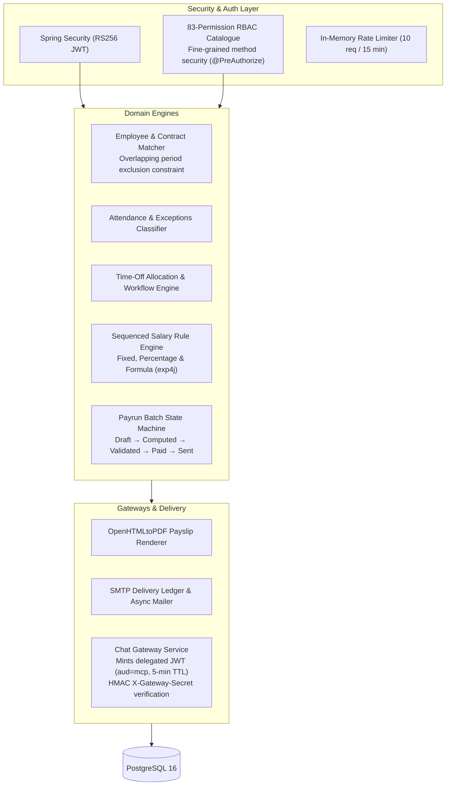

# PeoplePay360 Backend: Spring Boot 3.3 REST API

The Spring Boot backend is the single system of record and primary security authority for the **PeoplePay360** HR and Payroll platform. It encapsulates all core business logic: employee master records, period-specific contract matching, attendance rules, leave allocations and workflows, the sequenced salary rule engine, batch payrun execution, payslip PDF generation, SMTP delivery, immutable audit logging, and secure AI request delegation via the FastMCP Gateway.

The React frontend and Python FastMCP service operate as authorized clients against this API.

---

## 🛠️ Technology Stack

* **Language & Runtime**: Java 21 (LTS)
* **Framework**: Spring Boot 3.3.x
* **Persistence**: Spring Data JPA, Hibernate, PostgreSQL 16
* **Database Migrations**: Flyway (V001–V019)
* **Security & Auth**: Spring Security, OAuth2 Resource Server, RS256 JWT, Rate Limiting
* **Computation Engine**: `exp4j` (dynamic mathematical and percentage salary rule formulas)
* **Document Generation**: OpenHTMLtoPDF (high-fidelity payslip PDFs)
* **Email Service**: Spring Boot Mail (`JavaMailSender`, STARTTLS / SSL)
* **Build Tool**: Apache Maven

---

## 🏗️ Architecture & Core Responsibilities



1. **System of Record**: All state changes pass through strict transactional domain services with optimistic locking and Flyway-managed schema constraints.
2. **Salary Rule Engine**: Executes rule pipelines (Basic, Allowance, Gross, Deduction, Net) sequenced by order. Computation supports fixed constants, percentages of prior rules, and dynamic arithmetic formulas with `BigDecimal` rounding.
3. **Payrun State Machine**: Two-step payrun creation wizard (scope definition then employee selection). Blocks validation if critical prerequisites (e.g., missing employee bank accounts or overlapping contracts) are unmet.
4. **FastMCP AI Gateway**: Bridges user webchat queries to the Python FastMCP service:
   - Verifies incoming user JWT and `chat.access` authority.
   - Mints a short-lived, delegated JWT (`aud=mcp`, `act=chat`, 5-minute TTL) containing only the caller's specific permissions.
   - Sends the delegated request to the FastMCP service over HTTP with a constant-time HMAC `X-Gateway-Secret`.
   - Supports in-place prompt editing (`editMessageId` parameter) to re-evaluate and truncate subsequent chat turns in place.

---

## 🚀 Quick Start

### 1. Prerequisites
* **Java 21+**
* **PostgreSQL 16** with a running database instance
* **Maven 3.9+** (or use `./mvnw`)
* **SMTP Server** (e.g. Mailpit on port `1025` for local testing)

### 2. Database Initialization
Create a dedicated database and user:
```sql
CREATE DATABASE peoplepay;
CREATE USER peoplepay WITH PASSWORD 'peoplepay';
GRANT ALL PRIVILEGES ON DATABASE peoplepay TO peoplepay;
```

### 3. Configuration Setup
Copy the configuration template:
```bash
cp src/main/resources/application.properties.example src/main/resources/application.properties
```
*The real `application.properties` is ignored by Git to prevent credential leaks.*

### 4. Build & Run
Run via Maven:
```bash
# Set your active profile and encryption key
export SPRING_PROFILES_ACTIVE=demo
mvn spring-boot:run
```

Or package and execute the JAR:
```bash
mvn clean package -DskipTests
java -jar target/peoplepay360-backend.jar
```

* API Base: `http://localhost:8080`
* Swagger UI: `http://localhost:8080/swagger-ui/index.html`
* Health Endpoint: `http://localhost:8080/actuator/health`

---

## 👥 Seeded Demo Accounts (`demo` Profile)

On first run with `SPRING_PROFILES_ACTIVE=demo`, Flyway seeds 40 employees, 4 departments, schedules, contracts, attendance records, time-off allocations, and historical payruns (May to July 2026):

| Email | Password | Role | Permissions Scope |
|---|---|---|---|
| `admin@peoplepay.local` | `Admin@12345` | **Admin** | Full system administration, AI settings, audit log, user invites |
| `payroll.manager@peoplepay.local` | `Manager@12345` | **HR Payroll Manager** | Full payroll lifecycle: configure salary rules, validate & mark paid |
| `payroll@peoplepay.local` | `Payroll@12345` | **HR Payroll User** | Compute and review payruns; view payslips; cannot mark paid |
| `hr@peoplepay.local` | `Hr@12345` | **HR Manager** | People, contracts, attendance, time-off; payroll figures redacted |
| `employee@peoplepay.local` | `Employee@12345` | **Employee** | Self-service attendance check-in, leave requests, own payslips & chat |

---

## 📡 REST API Modules

| Endpoint Base | Authority | Description |
|---|---|---|
| `POST /api/auth/login` | Public | Authenticates credentials, returns RS256 JWT access token |
| `GET /api/auth/me` | `authenticated` | Returns user identity and effective permission set |
| `GET /api/employees` | `employee.read.all` / `.own` | Employee master records with department, manager, and contract links |
| `GET /api/contracts` | `contract.read.all` / `.own` | Employment contracts with wage, working schedule, and dates |
| `POST /api/attendance/check-in` | `attendance.record.own` | Daily check-in timestamp recording |
| `POST /api/attendance/check-out` | `attendance.record.own` | Daily check-out and automatic worked hours calculation |
| `GET /api/attendance/exceptions` | `attendance.read.all` | Exception radar: missing check-outs, late arrivals, absences |
| `GET /api/timeoff/balances` | `timeoff_allocation.read.own` | Leave balances (allocated, taken, pending, remaining) |
| `POST /api/timeoff/requests` | `timeoff_request.create.own` | Submit leave requests with approval workflow |
| `GET /api/salary-structures` | `salary_structure.read` | Salary structures and sequenced rule definitions |
| `GET /api/salary-rules` | `salary_rule.read` | All salary rules across structures with formulas and categories |
| `POST /api/payruns` | `payrun.create` | 2-step payrun creation wizard |
| `POST /api/payruns/{id}/compute` | `payrun.compute` | Batch computation of payslips across chosen employees |
| `POST /api/payruns/{id}/validate` | `payrun.validate` | Validates payrun; checks for blocking issues |
| `POST /api/payruns/{id}/pay` | `payrun.pay` | Marks payrun paid; triggers payslip immutability constraint |
| `POST /api/payruns/{id}/email` | `payrun.email` | Bulk async payslip PDF generation and SMTP delivery |
| `GET /api/reports/dashboard` | `dashboard.read.hr` | Live KPIs with role-based server-side redaction |
| `GET /api/chat/sessions` | `chat.access` | Lists caller's conversation sessions |
| `POST /api/chat/sessions` | `chat.access` | Creates a new chat session |
| `POST /api/chat/sessions/{id}/messages` | `chat.access` | Sends prompt (or edits prompt via `editMessageId`) via FastMCP Gateway |
| `GET /api/chat/capabilities` | `chat.access` | Discovers available AI provider status and active MCP tools |

---

## 🧪 Testing & Verification

```bash
# Run 59 fast unit tests (no database required)
mvn test

# Run full integration suite against PostgreSQL (43 integration tests)
mvn verify -Pit
```

* **Unit Tests**: Rule engine arithmetic, formula parser, schedule calculations, attendance classification, grant policy, password complexity, and 5 ArchUnit architecture constraint rules.
* **Integration Tests**: End-to-end authentication, RBAC authorization matrix, IDOR security, payrun wizard pre-validation, payslip immutability triggers, and chat gateway fallback.

---

## 📁 Package Organization

```text
backend/src/main/java/com/peoplepay360/
├── common/             # Global error handlers, audit logging, AES-GCM converters
├── config/             # SecurityFilterChain, JWT RS256, CORS, ApplicationProperties
├── controller/         # Spring MVC REST controllers
├── dto/                # Immutable Java records for request & response contracts
├── model/              # Hibernate JPA domain entities
├── repository/         # Spring Data JPA repositories with query specifications
├── security/           # JWT authentication filter, RBAC evaluators, rate limiting
└── service/            # Domain services, rule engine, PDF renderer, mailer, ChatGatewayService
```
